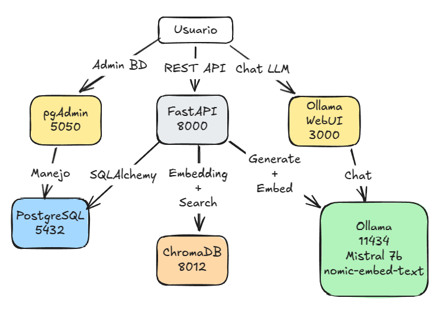
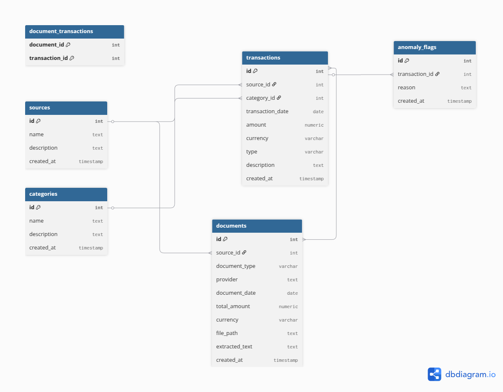

# Enterprise Finance AI

Sistema de gestion financiera inteligente que combina una API REST, una base de datos relacional, un motor de busqueda vectorial y un LLM local para automatizar la ingesta, clasificacion y consulta de datos financieros.

## Arquitectura



**Stack tecnologico:**

| Componente | Tecnologia | Funcion |
|---|---|---|
| API | FastAPI + Python 3.11 | Backend REST |
| Base de datos | PostgreSQL 14 | Transacciones, documentos, categorias |
| ORM | SQLAlchemy | Mapeo objeto-relacional |
| Vector DB | ChromaDB 0.6.3 | Embeddings de documentos |
| LLM | Ollama (Mistral 7B) | Mapeo de columnas, clasificacion, agente |
| Embeddings | nomic-embed-text | Vectorizacion de texto |
| Contenedores | Docker Compose | Orquestacion de servicios |

## Funcionalidades

### 1. Pipeline de Ingesta Inteligente (`POST /upload_data/`)

Sube cualquier archivo CSV o Excel (.xlsx) con datos financieros. El sistema:

1. Detecta el formato del archivo automaticamente
2. Envia las columnas y datos de ejemplo al LLM
3. El LLM mapea las columnas al schema de la BD (fecha, monto, tipo, descripcion, moneda)
4. Clasifica las descripciones unicas en categorias existentes o nuevas usando el LLM
5. Inserta hasta 500 transacciones por archivo

**No requiere un formato fijo de columnas.** Funciona con archivos en cualquier idioma y estructura, siempre que contengan datos financieros.

### 2. Almacenamiento de Documentos (`POST /upload_docs/`)

Sube archivos PDF (facturas, recibos, estados de cuenta). El sistema:

1. Extrae el texto del PDF
2. Genera embeddings con nomic-embed-text
3. Almacena el documento en PostgreSQL y los embeddings en ChromaDB

### 3. Busqueda Semantica de Documentos (`GET /documents/search?q=...`)

Busca documentos por similitud semantica. Usa embeddings para encontrar los documentos mas relevantes a una consulta en lenguaje natural.

### 4. RAG - Preguntas sobre Documentos (`POST /ask?question=...`)

Responde preguntas basandose en el contenido de los documentos subidos:

1. Busca documentos relevantes en ChromaDB
2. Arma un contexto con los resultados
3. El LLM genera una respuesta basada en ese contexto

### 5. Agente Financiero (`POST /agent?question=...`)

Un agente conversacional con acceso a herramientas:

| Herramienta | Funcion |
|---|---|
| `search_documents` | Busca en documentos financieros |
| `query_transactions` | Consulta transacciones por categoria o tipo |
| `get_summary` | Resume financiero con totales de ingresos, gastos y balance |
| `list_categories` | Lista todas las categorias disponibles |

El agente decide automaticamente que herramienta usar segun la pregunta:
- *"Cuanto gaste en total?"* -> `get_summary`
- *"Que categorias tengo?"* -> `list_categories`
- *"Mostrame los gastos de Rent"* -> `query_transactions`

### 6. Consultas Directas

- `GET /categories` - Lista todas las categorias
- `GET /transactions` - Lista todas las transacciones

## Modelo de Datos



## Requisitos

- Docker y Docker Compose
- 8 GB de RAM minimo (Ollama con Mistral 7B requiere ~4-5 GB)
- Puertos disponibles: 3000, 5050, 5432, 8000, 8012, 11434

## Instalacion y Ejecucion

### 1. Clonar el repositorio

```bash
git clone <url-del-repositorio>
cd billetera-proyecto
```

### 2. Levantar los servicios

```bash
docker compose up --build
```

La primera vez descarga las imagenes y construye los contenedores. Puede tomar varios minutos.

### 3. Descargar los modelos de Ollama

Una vez que el contenedor de Ollama este corriendo:

```bash
docker exec -it ollama ollama pull mistral:7b
docker exec -it ollama ollama pull nomic-embed-text
```

### 4. Verificar

- API: http://localhost:8000/docs (Swagger UI)
- pgAdmin: http://localhost:5050 (email: `developer@peperina.io`, password: `passpeperina`)
- Ollama WebUI: http://localhost:3000

## Como Probar

### Subir un archivo CSV

```bash
curl -X POST http://localhost:8000/upload_data/ \
  -F "file=@data/transactions.csv"
```

Respuesta esperada:
```json
{
  "message": "Successfully inserted 11 transactions",
  "inserted": 11,
  "categories_created": 11,
  "columns_detected": ["transaction_date", "amount", "currency", "type", "category", "description", "source"],
  "mapping_used": { ... }
}
```

### Subir un archivo Excel

```bash
curl -X POST http://localhost:8000/upload_data/ \
  -F "file=@data/bank_statement.xlsx"
```

### Subir un documento PDF

```bash
curl -X POST http://localhost:8000/upload_docs/ \
  -F "file=@mi_factura.pdf"
```

### Preguntar al agente

```bash
curl -X POST "http://localhost:8000/agent?question=Cuanto%20gaste%20en%20total"
```

### Buscar documentos

```bash
curl "http://localhost:8000/documents/search?q=factura%20electricidad"
```

### Preguntar sobre documentos (RAG)

```bash
curl -X POST "http://localhost:8000/ask?question=Cual%20es%20el%20total%20de%20la%20factura"
```

## Estructura del Proyecto

```
billetera-proyecto/
├── api/
│   ├── main.py              # Entry point FastAPI, registra routers
│   ├── read_docs.py          # Pipeline ingesta CSV/XLSX inteligente
│   ├── storage_docs.py       # Upload y embedding de PDFs
│   ├── search_docs.py        # Busqueda semantica de documentos
│   ├── ask_user.py           # RAG - preguntas sobre documentos
│   └── agent/
│       ├── agent.py          # Logica del agente (tool selection + LLM)
│       ├── tools.py          # Herramientas del agente (query, summary, search)
│       └── router.py         # Endpoint del agente
├── connection/
│   ├── database.py           # Conexion SQLAlchemy a PostgreSQL
│   └── models.py             # Modelos ORM (Transaction, Category, etc.)
├── docker/
│   ├── Dockerfile            # Imagen Python + FastAPI
│   └── requirements.txt      # Dependencias Python
├── sql/
│   └── create.sql            # Schema inicial de la BD
├── data/                     # Archivos de ejemplo para pruebas
│   ├── transactions.csv
│   ├── bank_statement.xlsx
│   └── movimientos_mixto.csv
├── docker-compose.yml        # Orquestacion de 6 servicios
└── README.md
```

## Proximos Pasos

- **OCR para facturas/recibos**: Soporte para imagenes (PNG, JPG) y PDFs escaneados, extraccion de datos con OCR e insercion automatica como transacciones
- **Categorias bilingues**: Nombre en ingles y español para cada categoria, respuestas del agente en el idioma de la pregunta
- **Deteccion de anomalias**: Identificar transacciones inusuales usando la tabla `anomaly_flags`
- **Dashboard**: Interfaz web para visualizar gastos, ingresos y tendencias
- **Deduplicacion**: Evitar insertar transacciones duplicadas al subir el mismo archivo multiples veces

## Servicios y Puertos

| Servicio | Puerto | Descripcion |
|---|---|---|
| FastAPI | 8000 | API REST principal |
| PostgreSQL | 5432 | Base de datos relacional |
| pgAdmin | 5050 | Administracion de BD |
| Ollama | 11434 | Servidor LLM local |
| Ollama WebUI | 3000 | Interfaz chat para LLM |
| ChromaDB | 8012 | Base de datos vectorial |
