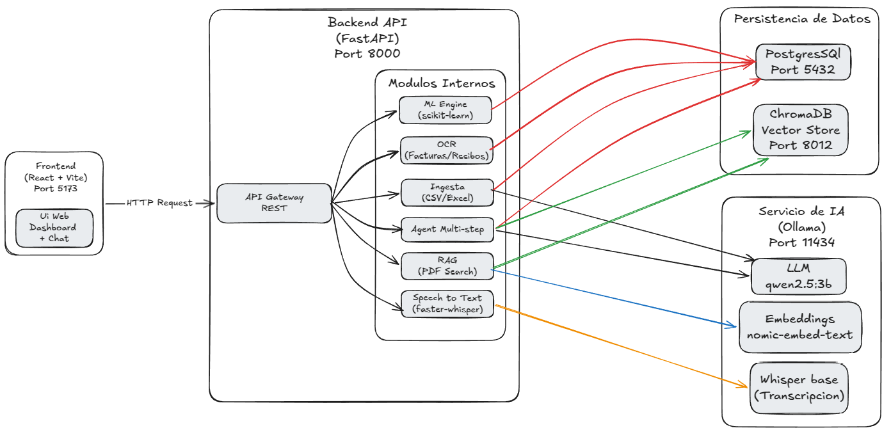
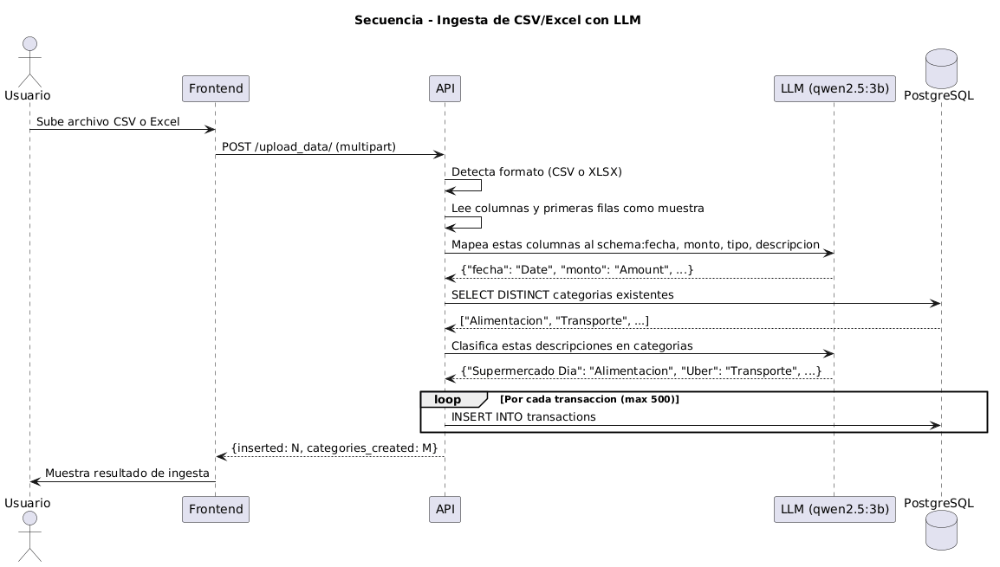
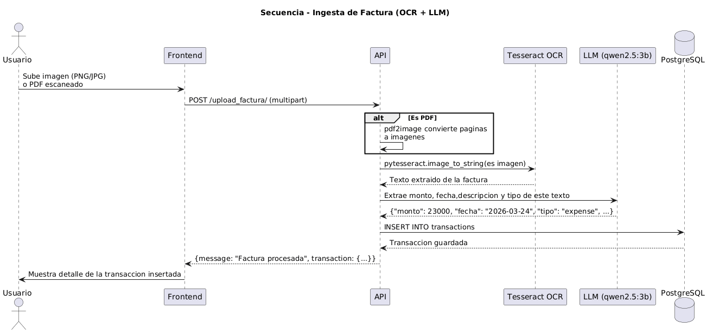
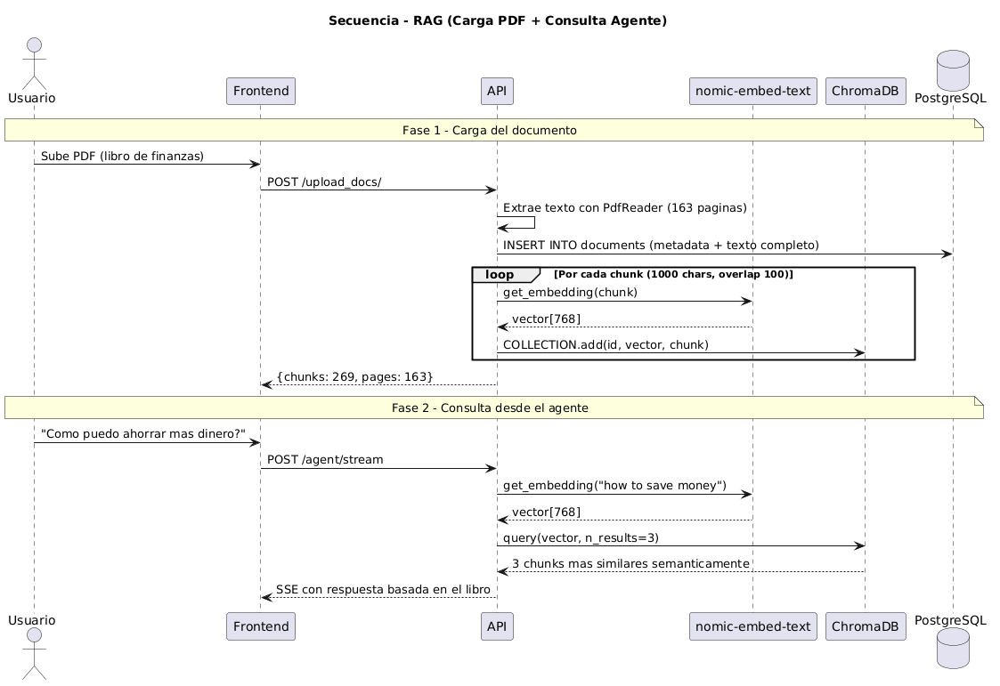
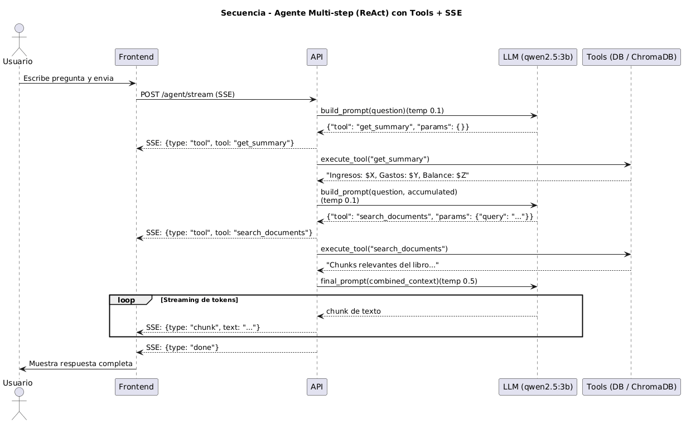
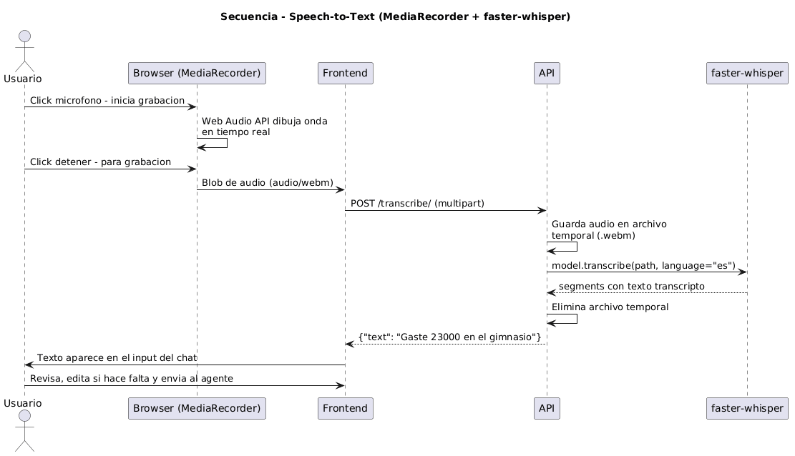

# Qash — Sistema Financiero Inteligente con LLM

Aplicacion de finanzas personales que combina un agente conversacional multi-step, RAG sobre documentos, Machine Learning, OCR y entrada por voz, todo corriendo localmente con Docker.

## Arquitectura


## Stack Tecnologico

| Componente | Tecnologia | Funcion |
|---|---|---|
| Frontend | React + Vite + Recharts | Interfaz de usuario y graficos |
| API | FastAPI + Python 3.11 | Backend REST + streaming SSE |
| ORM | SQLAlchemy | Mapeo objeto-relacional |
| Base de datos | PostgreSQL 14 | Almacen de movimiento, documentos, etc |
| Vector DB | ChromaDB | Embeddings y busqueda semantica |
| LLM | Groq API (llama-3.1-8b-instant) | Agente, mapeo de columnas, clasificacion, OCR |
| Embeddings | Ollama (nomic-embed-text) | Vectorizacion de texto para RAG |
| STT | faster-whisper (base) | Transcripcion de audio a texto |
| ML | scikit-learn | Prediccion de gastos y deteccion de anomalias |
| OCR | Tesseract + pdf2image | Extraccion de texto desde imagenes y PDFs |
| Contenedores | Docker Compose | Orquestacion de servicios |

## Funcionalidades

### 1. Pipeline de Ingesta Inteligente (`POST /upload_data/`)

Acepta cualquier CSV o Excel con datos financieros, sin formato fijo:

1. Detecta el formato del archivo automaticamente
2. Envia las columnas y ejemplos al LLM
3. El LLM mapea columnas al schema de la BD y clasifica descripciones en categorias
4. Inserta hasta 500 transacciones por archivo



### 2. OCR para Facturas y Recibos (`POST /upload_factura/`)

Acepta imagenes (PNG, JPG) y PDFs escaneados:

1. Convierte el PDF a imagen si es necesario
2. Extrae el texto con Tesseract OCR
3. El LLM interpreta los datos (monto, fecha, descripcion, tipo)
4. Inserta la transaccion automaticamente



### 3. RAG — Documentos Financieros (`POST /upload_docs/`)

Carga libros o documentos PDF para consultarlos desde el agente:

1. Extrae el texto del PDF
2. Divide el texto en chunks de 1000 caracteres con 100 de overlap
3. Genera embeddings con nomic-embed-text para cada chunk
4. Almacena en ChromaDB indexado por documento y chunk



### 4. Agente Financiero Conversacional con Streaming (`POST /agent/stream`)

Agente multi-step con patron ReAct. Encadena hasta 2 herramientas antes de responder:

| Herramienta | Funcion |
|---|---|
| `query_transactions` | Consulta transacciones por categoria, tipo, mes o año |
| `get_summary` | Resumen con totales de ingresos, gastos y balance |
| `list_categories` | Lista todas las categorias disponibles |
| `insert_transaction` | Registra una nueva transaccion desde lenguaje natural |
| `get_max_expense` | Devuelve la transaccion de mayor gasto |
| `get_max_income` | Devuelve el mayor ingreso registrado |
| `get_top_expenses` | Top N gastos mas altos (con filtro por mes/categoria) |
| `get_category_summary` | Detalle de una categoria especifica |
| `search_documents` | Busqueda semantica en documentos subidos (RAG) |

Las respuestas se envian en streaming via **Server-Sent Events (SSE)**, mostrando cada token a medida que el LLM lo genera.

Ejemplo de flujo multi-step:
- *"En que me puede ayudar el libro para mejorar mis finanzas?"*
  - Step 1: `get_summary` → obtiene balance real del usuario
  - Step 2: `search_documents` → busca consejos relevantes en el libro
  - Respuesta final: combina datos reales + consejos del libro



### 5. Machine Learning (`GET /ml/forecast` y `GET /ml/anomalies`)

**Prediccion de gastos** con regresion lineal:
- Agrupa transacciones por mes
- Entrena un modelo `LinearRegression` con el historial
- Predice el gasto del proximo mes (clampeado a 0 para evitar negativos)
- Devuelve el R² score como indicador de calidad

**Deteccion de anomalias** con IsolationForest:
- Normaliza features con `StandardScaler`
- Aplica `IsolationForest` sobre [gasto mensual, ingreso mensual]
- Marca los meses con comportamiento inusual como anomalos

### 6. Entrada por Voz (`POST /transcribe/`)

Graba audio desde el microfono en el frontend y lo transcribe:

1. `MediaRecorder` captura el audio en el browser
2. Se envia el blob de audio al backend
3. `faster-whisper` transcribe con el modelo `base` en español
4. El texto aparece en el input del chat listo para editar y enviar

Incluye visualizacion de onda de audio en tiempo real con Web Audio API.


## Modelo de Datos



## Requisitos

- Docker y Docker Compose
- 4 GB de RAM minimo
- API Key de Groq (`GROQ_API_KEY`) — registro gratuito en console.groq.com
- Puertos disponibles: 5173, 5432, 5050, 8000, 8012, 11434, 3000

## Instalacion

### 1. Clonar el repositorio

```bash
git clone https://github.com/NicolasVera4/billetera-virtual-ia
cd billetera-proyecto
```

### 2. Configurar variables de entorno

Crear un archivo `.env` en la raiz del proyecto:

```bash
GROQ_API_KEY=tu_api_key_aqui
```

### 3. Levantar los servicios

```bash
docker compose up --build
```

La primera vez descarga imagenes y construye los contenedores. Puede tomar varios minutos.

### 4. Descargar el modelo de embeddings

```bash
docker exec -it ollama ollama pull nomic-embed-text
```

### 5. Levantar el frontend

```bash
cd frontend
npm install
npm run dev
```

### 6. Verificar

| Servicio | URL |
|---|---|
| Frontend (Qash) | http://localhost:5173 |
| API Swagger | http://localhost:8000/docs |
| pgAdmin | http://localhost:5050 |
| Ollama | http://localhost:11434 |
| Ollama WebUI | http://localhost:3000 |

## Servicios y Puertos

| Servicio | Puerto | Descripcion |
|---|---|---|
| Frontend React | 5173 | Interfaz de usuario |
| FastAPI | 8000 | API REST principal |
| PostgreSQL | 5432 | Base de datos relacional |
| pgAdmin | 5050 | Administracion de BD |
| Ollama | 11434 | Servidor de embeddings local |
| Ollama WebUI | 3000 | Interfaz web para Ollama |
| ChromaDB | 8012 | Base de datos vectorial |
